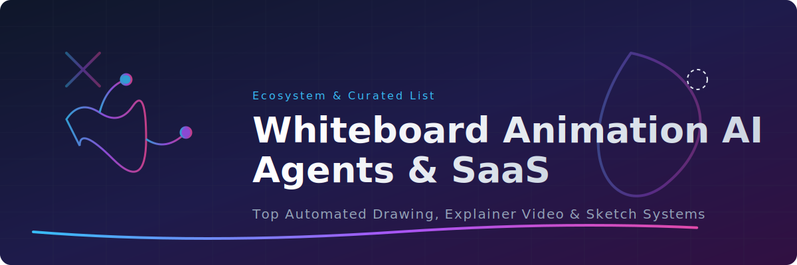

# Awesome Whiteboard Animation AI Agents 🎨🤖

  

  
  
  
  

---

## 🌟 Top Whiteboard Animation Building AI Agents Ecosystem

**Curated List of SaaS Products & Open-Source GitHub Projects**  
*Focused on AI-Powered Whiteboard Animation, Explainer Videos, Drawing Agents, and Video Generation Pipelines*  
**Last updated: June 2026**

This repository tracks notable **SaaS platforms** and **open-source projects** building **Whiteboard Animation AI Agents**. These tools automatically generate hand-drawn style animations, explainer videos, and educational content from text prompts, scripts, or outlines with smooth drawing effects, sketch transitions, and voiceover synchronization.

✨ **Examples** include Golpo AI (also known as Gulpo AI), Animaker Whiteboard 3.0, Renderforest, and DoodleMaker. Tools listed here emphasize **natural drawing simulation**, script-to-animation conversion, character consistency, and easy customization.

💻 **Open-source emphasis**: This section is heavily expanded with active projects for self-hosting, local execution, full customization, and unlimited creation — ideal for educators, content creators, and developers who want complete control over their whiteboard animations.

🤝 Contributions welcome! Open a PR to add/update entries. Keep descriptions factual and link to official sites.

## Table of Contents
- [SaaS Products](#saas-products)
- [Open-Source GitHub Projects](#open-source-github-projects)
- [How to Contribute](#how-to-contribute)
- [Disclaimer](#disclaimer)

## SaaS Products

| Product | Focus | Description | Pricing | Free Tier Limit | Company Size (Est. Revenue / Valuation) |
| :--- | :--- | :--- | :--- | :--- | :--- |
| **[Vyond](https://www.vyond.com/)** | Advanced & Specialized | Enterprise-focused explainer video platform with professional whiteboard styles. | Starts at $699/yr (approx. $58/mo) | No free tier; trial limited to 3 watermarked videos, no downloads | ~$100M Valuation / ~$100M Revenue |
| **[Animaker Whiteboard 3.0](https://www.animaker.com/)** | Core Platform (Whiteboard AI Agents) | Powerful builder with AI features for scene generation and character animation. | Starts at $20/mo (or $10/mo annually) | Watermarked exports, limited templates, 2 custom characters/mo | ~$90M Valuation / ~$22M - $30M Revenue |
| **[Powtoon](https://www.powtoon.com/)** | Advanced & Specialized | Visual communication platform with whiteboard styles and templates. | Starts at ~$15/mo (billed annually) | Watermarked exports, max 3 mins/video, 100 MB storage | ~$45.5M Valuation / ~$15.2M Revenue |
| **[Renderforest](https://www.renderforest.com/)** | Core Platform (Whiteboard AI Agents) | AI-driven platform with whiteboard and explainer video templates and automation. | Starts at ~$14/mo | Watermarked videos, max 3 mins/video, 5 AI image credits | ~$31.7M Valuation / ~$10.5M Revenue |
| **[DoodleMaker](https://doodlemaker.com/)** | Core Platform (Whiteboard AI Agents) | AI whiteboard animation tool focused on hand-drawn style explainer videos. | One-time $49 – $69 | No free tier or trial | ~$5M Valuation / ~$2M Revenue |
| **[Golpo AI (Gulpo AI)](https://golpo.ai/)** | Core Platform (Whiteboard AI Agents) | Intelligent AI agent specialized in creating whiteboard animations from text or scripts. | Starts at $39.99/mo | 1 credit/mo, no video downloads, watermarked | ~$1.7M Valuation / ~$550K Revenue |

## Open-Source GitHub Projects

### Dedicated Whiteboard Animation & AI Drawing Agents

- **[Manim](https://github.com/3b1b/manim)**   
  The famous open-source mathematical animation engine used by 3Blue1Brown. Perfect for creating high-quality whiteboard-style educational animations programmatically.

- **[CrewAI Animation Crews](https://github.com/crewAIInc/crewAI)**   
  Role-based multi-agent system for creating complete whiteboard animation workflows (script → storyboard → animation).

- **[Manim Community](https://github.com/ManimCommunity/manim)**   
  Active community fork of Manim with extensive features for educational and explanatory animations.

- **[LangGraph Whiteboard Agents](https://github.com/langchain-ai/langgraph)**   
  Stateful multi-agent framework for building AI agents that generate and animate whiteboard content step-by-step.

- **[Blender Grease Pencil](https://github.com/blender/blender)**   
  Powerful open-source 2D animation tool within Blender for hand-drawn and whiteboard-style animations.

- **[Krita](https://github.com/KDE/krita)**   
  Professional open-source painting and drawing software with animation and AI plugins for hand-drawn whiteboard effects.

- **[OpenToonz](https://github.com/opentoonz/opentoonz)**   
  Professional open-source 2D animation software with strong drawing and timeline tools suitable for whiteboard effects.

- **[Draw.io / Diagrams.net](https://github.com/jgraph/drawio)**  with animation extensions  
  Open-source diagramming tool often used for simple whiteboard-style explanatory animations.

- **[chaiNNer](https://github.com/chaiNNer-org/chaiNNer)**   
  Node-based GUI for chaining AI models including upscalers and animation tools for video output.

- **[Kdenlive](https://github.com/KDE/kdenlive)**   
  Open-source video editor with drawing and animation tools that can be combined with AI for whiteboard effects.

- **[Synfig Studio](https://github.com/synfig/synfig)**   
  Open-source 2D vector animation software with powerful bone rigging and cut-out animation capabilities.

### Additional Open-Source Tools & Pipelines

- **Stable Diffusion + ControlNet** for generating whiteboard-style frames.
- **AnimateDiff** for creating smooth animated sequences from generated images.
- **FFmpeg** scripts for assembling and optimizing final whiteboard videos.
- Many community **Manim + LLM** pipelines for text-to-whiteboard animation agents.

**Frameworks for building custom agents**: Combine **Manim**, **Blender Grease Pencil**, **LangGraph**, and **CrewAI** with **Ollama** for fully local, intelligent whiteboard animation creation systems.

## How to Contribute

1. Fork the repo.
2. Add/edit entries in `README.md` (follow existing format).
3. Include: name, link, 1–2 sentence description, and whether it's SaaS or open-source.
4. Submit PR with a short explanation.

Star the repo if you find it useful!

## Star History

<a href="https://www.star-history.com/?repos=ishandutta2007%2FAwesome-Whiteboard-Animation-AI-Agents&type=date&legend=bottom-right">
<picture>
<source media="(prefers-color-scheme: dark)" srcset="https://api.star-history.com/chart?repos=ishandutta2007/Awesome-Whiteboard-Animation-AI-Agents&type=date&theme=dark&legend=bottom-right" />
<source media="(prefers-color-scheme: light)" srcset="https://api.star-history.com/chart?repos=ishandutta2007/Awesome-Whiteboard-Animation-AI-Agents&type=date&legend=bottom-right" />

</picture>
</a>

## Disclaimer

- This is a **community-curated** list — not exhaustive and not an endorsement.
- Generated animations should respect copyright when using reference styles or characters.
- Self-hosted open-source tools may require significant GPU resources for high-quality results.

---

**Made for educators, content creators, marketers, and indie animators.**  
Let's make whiteboard animation more accessible, creative, and fully controllable.